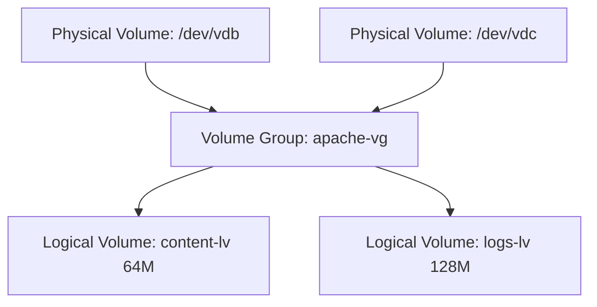

# Introduzione a LVM su RHEL Linux

LVM (Logical Volume Manager) è una tecnologia di gestione del disco che consente di creare volumi flessibili e dinamici, più facili da ridimensionare rispetto alle partizioni tradizionali.

---

## Componenti Principali

### 1. **Physical Volume (PV)**
- Disco fisico o partizione.
- Esempio: `/dev/vdb`, `/dev/sda2`
- Si inizializza con `pvcreate`.

### 2. **Volume Group (VG)**
- Insieme di uno o più PV.
- Spazio aggregato dove vengono creati i volumi logici.
- Si crea con `vgcreate`.

### 3. **Logical Volume (LV)**
- "Volume virtuale" all’interno di un VG.
- Può essere formattato, montato e ridimensionato.
- Si crea con `lvcreate`.

---

## Flusso Tipico

```bash
# 1. Inizializza un PV
sudo pvcreate /dev/vdb

# 2. Crea un VG
sudo vgcreate dati-vg /dev/vdb

# 3. Crea un LV da 1GB
sudo lvcreate -L 1G -n archivio dati-vg

# 4. Formatta con XFS
sudo mkfs.xfs /dev/dati-vg/archivio

# 5. Crea il punto di mount
sudo mkdir -p /mnt/archivio

# 6. Monta il volume
sudo mount /dev/dati-vg/archivio /mnt/archivio
```

---

## Diagramma dei Componenti



---

## 💡 Vantaggi di LVM

- Ridimensionamento facile dei volumi.
- Snapshot (copie temporanee dello stato).
- Uso efficiente dello spazio su disco.
- Possibilità di aggregare dischi fisici.

---

## 🔍 Comandi utili

| Operazione      | Comando                     |
|-----------------|-----------------------------|
| Elenco PV       | `pvs`                       |
| Elenco VG       | `vgs`                       |
| Dettagli VG     | `vgdisplay`                 |
| Elenco LV       | `lvs`                       |
| Dettagli LV     | `lvdisplay`                 |

---


LVM è uno strumento fondamentale per chi gestisce storage su sistemi Linux professionali come RHEL. Con Ansible, puoi automatizzare tutta la configurazione in modo elegante e ripetibile.

