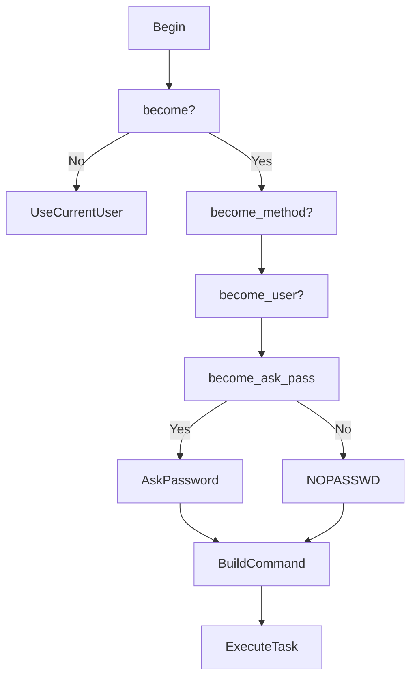

```mermaid
flowchart TD
    Begin --> become?
    become? -- No --> UseCurrentUser
    become? -- Yes --> become_method?
    become_method? --> become_user?
    become_user? --> become_ask_pass
    become_ask_pass -- Yes --> AskPassword
    become_ask_pass -- No --> NOPASSWD
    AskPassword --> BuildCommand
    NOPASSWD --> BuildCommand
    BuildCommand --> ExecuteTask
```
